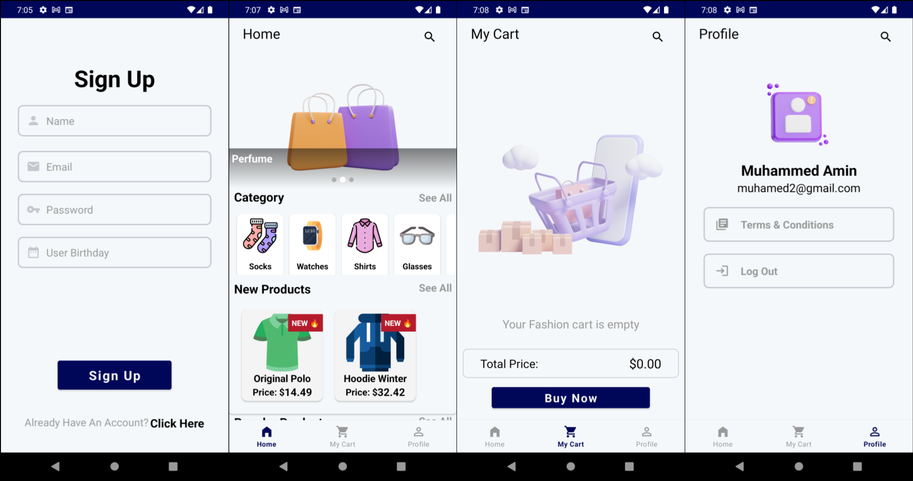

# Fashion-Zone

Fashion-Zone is a feature-rich e-commerce application that provides users with an engaging shopping experience for a wide variety of clothing items. The app is designed for both users and administrators, enabling efficient management and smooth user interaction.

## Screenshots

.png)
.png)

---

## Features

### User Features
1. **Onboarding**:
   - A guided walkthrough showcasing the main functionalities of the application.

2. **Authentication**:
   - Users can sign up or log in to their accounts to access the app.

3. **Shopping Experience**:
   - Browse categories like Socks, Watches, Shirts, Glasses, and more.
   - View New Products, Popular Products, and other clothing items.
   - Select an item (e.g., T-shirts) and:
     - Add it to the cart.
     - Purchase it directly.
     - Increase the quantity of an item up to a maximum of 10 items per transaction or the available stock (whichever is lower).

4. **Cart Management**:
   - Items added to the cart can be reviewed and managed.
   - Purchase multiple items together from the cart.

5. **Payment Process**:
   - Select or fetch the current address using the "Get My Current Location" button.
   - Add payment details (e.g., card information).
   - View payment summary and confirm payment.
   - Provide a rating for the transaction.
   - Navigate back to the home screen after completing the process.

### Admin Features
1. **Authentication**:
   - Admins log in with a predefined email and password.

2. **Product Management**:
   - Add new items to any category (New Products, Popular Products, or other categories).
   - Update or delete existing products.

3. **Payment History**:
   - View the payment history of all users.

4. **Analytics**:
   - View a pie chart that displays each user's average payment rating (e.g., User A with 10 payments and an average rating of 5 stars would have a segment in the pie chart).

## Libraries Used
- **Java**: Core programming language for app development.
- **XML**: For designing user interfaces.
- **Glide**: Image loading and caching.
- **ImageSliderShow**: Creating image carousels.
- **SpinKit**: Loading animations.
- **Google Play Services Location**: Fetching the user’s current location.
- **SwipeRefreshLayout**: Implementing pull-to-refresh functionality.
- **Razorpay:checkout**: Payment gateway integration.
- **AnyChart**: Generating pie charts for analytics.
- **JourneyApps:ZXing-Android-Embedded**: Barcode scanning capabilities.

Fashion-Zone combines a seamless shopping experience with powerful administrative tools, making it a complete solution for managing an e-commerce platform.
